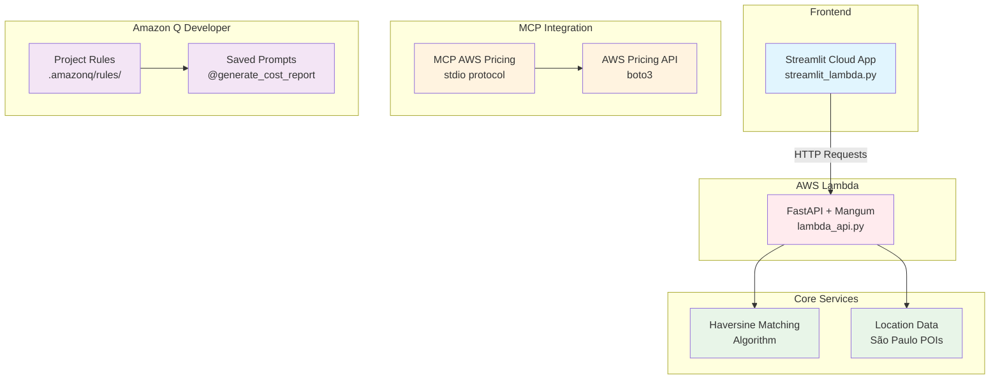

# Go Together - Sistema de Matching de Caronas

[](https://github.com/cauepda/go-together)
[](https://aws.amazon.com/lambda/)
[](https://streamlit.io/)
[](https://modelcontextprotocol.io/)

Sistema completo de matching de caronas com API Lambda, interface Streamlit e integração MCP AWS Pricing.


## 🚀 Funcionalidades

- **🎯 Matching Inteligente**: Algoritmo Haversine para conexão por proximidade
- **💰 Cálculo de Custos**: Divisão automática e estimativas AWS
- **🗺️ Interface Interativa**: Streamlit com mapas e busca de locais
- **☁️ Deploy AWS**: Lambda + Streamlit Cloud
- **🔧 MCP Integration**: Servidor AWS Pricing para estimativas em tempo real
- **📊 Relatórios**: Geração automática via prompts naturais

## 🏢 Arquitetura



## 🚀 Deploy e Execução

### Streamlit Cloud (Produção)
```bash
# App: streamlit_lambda.py
# URL: https://go-together.streamlit.app
```

### AWS Lambda (API)
```bash
# Função: go-together-api-v2
# URL: https://pafdiqphnfz7xmrvigggixcisy0isnmr.lambda-url.us-east-1.on.aws/
```

### Desenvolvimento Local
```bash
# 1. Instalar dependências
pip install -r requirements.txt

# 2. API local
uvicorn lambda_api:app --reload

# 3. Streamlit local
streamlit run streamlit_lambda.py
```

## Endpoints

### POST /routes
Cria nova rota de motorista
```json
{
  "driver_id": "motorista1",
  "start": {"lat": -23.5505, "lon": -46.6333, "name": "Centro SP"},
  "end": {"lat": -23.5629, "lon": -46.6544, "name": "Vila Madalena"},
  "max_detour_km": 5.0,
  "cost_per_km": 1.5
}
```

### POST /find-matches
Busca matches para passageiro
```json
{
  "passenger_id": "passageiro1",
  "pickup": {"lat": -23.5475, "lon": -46.6361, "name": "República"},
  "dropoff": {"lat": -23.5558, "lon": -46.6396, "name": "Consolação"}
}
```

### GET /routes
Lista todas as rotas disponíveis

## Testar

### Testes da API
```bash
python3 test_api.py
```

### 🆕 Testes da Integração MCP AWS Pricing
```bash
python3 test_mcp_integration_enhanced.py
```

### Gerar Relatório de Custos
```python
from mcp_aws_pricing import generate_cost_report
print(generate_cost_report("Estime custos mensais do Lambda go-together-api-v2"))
```

## 🆕 Integração MCP AWS Pricing

### Configuração MCP
Arquivo: `~/.aws/amazonq/agents/default.json`
```json
{
  "mcpServers": {
    "aws-pricing": {
      "command": "npx",
      "args": ["-y", "@aws/aws-pricing-mcp-server"],
      "env": {
        "AWS_REGION": "us-east-1"
      }
    }
  }
}
```

### Usar Servidor MCP via stdio
```bash
echo '{"tool": "generate_cost_report", "arguments": {"prompt": "test"}}' | python3 mcp_aws_pricing.py
```

### Usar Prompts Salvos
No Amazon Q chat:
```
@generate_cost_report Estime custos mensais do Lambda go-together-api-v2
```

### Verificar Ferramentas MCP
```
/tools
```

### Testar Protocolo MCP
```bash
python3 test_mcp_protocol.py
```

### Funcionalidades MCP
- ✅ Estimativa de custos AWS Lambda em tempo real
- ✅ Integração com boto3 AWS Pricing API
- ✅ Cálculo de custos por grupo de passageiros
- ✅ Relatórios via prompts naturais
- ✅ Fallback pricing quando AWS não disponível
- ✅ Protocolo MCP via stdio (JSON request/response)
- ✅ Compatibilidade com Amazon Q Developer

## 📚 Documentação

- **API Docs**: [Lambda Function URL](https://pafdiqphnfz7xmrvigggixcisy0isnmr.lambda-url.us-east-1.on.aws/docs)
- **Arquitetura**: [Diagrama Detalhado](architecture.md)
- **Deploy**: [Instruções Completas](deploy_instructions.md)
- **GitHub**: [Repositório Público](https://github.com/cauepda/go-together)

### 🏷️ Tags e Identificação
- **Tag GitHub**: `q-developer-quest-tdc-2025`
- **Gerado com**: Amazon Q Developer
- **Quest**: TDC 2025 - Todas as 4 etapas completas

### 🔗 Links Úteis
- [AWS Lambda Pricing](https://aws.amazon.com/lambda/pricing/)
- [MCP Protocol](https://modelcontextprotocol.io/)
- [Streamlit Cloud](https://streamlit.io/cloud)

## 💰 Estimativa de Custos AWS

### Configuração Lambda (go-together-api-v2)
- **Invocações/mês**: 1,000,000
- **Duração média**: 200ms
- **Memória**: 512MB
- **Região**: us-east-1

### Custos Mensais
- **Requests**: $0.2000
- **Compute**: $1.6667
- **TOTAL MENSAL**: $1.8667
- **PROJEÇÃO ANUAL**: $22.40

### Custo por Utilização
- **Por invocação**: $0.00000187
- **Por grupo (1 passageiro)**: $0.00000187/pessoa
- **Por grupo (2 passageiros)**: $0.00000094/pessoa
- **Por grupo (3 passageiros)**: $0.00000062/pessoa
- **Por grupo (4 passageiros)**: $0.00000047/pessoa

### Cenários de Crescimento
| Cenário | Invocações/mês | Custo Mensal | Custo Anual |
|---------|----------------|--------------|-------------|
| Atual | 1M | $1.87 | $22.40 |
| 2x Crescimento | 2M | $3.73 | $44.80 |
| 5x Crescimento | 5M | $9.33 | $112.00 |
| 10x Crescimento | 10M | $18.67 | $224.00 |

### Otimizações Possíveis
- **Reduzir memória para 256MB**: ~50% economia no compute
- **Otimizar duração para 100ms**: ~50% economia no compute
- **Usar ARM Graviton2**: ~20% economia adicional
- **Custo otimizado estimado**: ~$0.47/mês (~$5.60/ano)

## 🎯 Q Developer Quest TDC 2025 - Status

### ✅ Etapa 1: Bolsinha cabos exclusiva AWS
- ✅ Projeto gerado com Amazon Q Developer
- ✅ Repositório público no GitHub
- ✅ Tag `q-developer-quest-tdc-2025`
- ✅ README.md com screenshot
- ✅ Lista de prompts utilizados

### ✅ Etapa 2: Mochilinha exclusiva AWS
- ✅ Tudo da Etapa 1
- ✅ Diagrama de arquitetura (Mermaid)
- ✅ Testes automatizados (MCP integration)

### ✅ Etapa 3: Garrafa + Toalha exclusiva AWS
- ✅ Tudo das Etapas 1 & 2
- ✅ Servidor MCP implementado
- ✅ Configuração Amazon Q Developer
- ✅ IaC com AWS CDK/Lambda

### ✅ Etapa 4: Camiseta da capivara AWS
- ✅ Tudo das Etapas 1, 2 & 3
- ✅ Estimativa de custos da solução

## 💬 Prompts Utilizados

1. **Matching Algorithm**: Gere um script Python para matching de caronas baseado em coordenadas e crie testes unitários
2. **FastAPI Development**: Crie uma API Python que receba dados de usuários e retorne matches com divisão de custos
3. **Streamlit Interface**: Gere um app Streamlit para cadastro de caronas com destino fixo
4. **Passenger-Only Model**: Reformule para conectar apenas passageiros via celular
5. **Location Enhancement**: Melhore seleção de origem com busca, mapa e categorias
6. **AWS CDK Deploy**: Gere código CDK para deploy da API FastAPI em Lambda
7. **Lambda Integration**: Altere Streamlit para consumir API Lambda
8. **Cost Analysis**: Faça análise de custos Lambda e adicione ao README
9. **Quest Compliance**: Analise repositório e atualize para atender todos os requisitos
