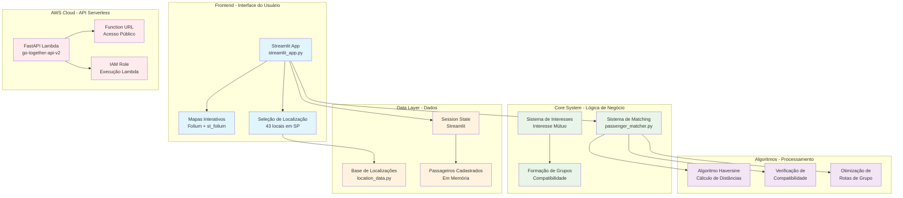

# Go Together - Sistema de Matching de Caronas

[](https://github.com/cauepda/go-together)
[](https://aws.amazon.com/lambda/)
[](https://streamlit.io/)
[](https://fastapi.tiangolo.com/)

Sistema completo de matching de passageiros com interface Streamlit, API Lambda e sistema de interesse mútuo.


## 🚀 Funcionalidades

### 👥 **Sistema de Passageiros**
- **🎯 Matching Inteligente**: Algoritmo Haversine para conexão por proximidade
- **💚 Interesse Mútuo**: Sistema tipo "Tinder" para formar grupos
- **📱 Conexão Direta**: Contatos telefônicos para organização
- **✏️ Edição de Dados**: Alterar informações e preferências
- **🗺️ Seleção de Origem**: Busca, mapa interativo ou categorias

### 🌐 **Interface Streamlit**
- **📝 Cadastro Completo**: Nome, telefone, origem e preferências
- **🔍 Encontrar Parceiros**: Sugestões baseadas em compatibilidade
- **💬 Gerenciar Interesses**: Enviar e receber demonstrações de interesse
- **👥 Grupos Formados**: Visualizar grupos com interesse mútuo
- **📋 Lista de Pessoas**: Ver todos os cadastrados
- **✏️ Editar Dados**: Modificar ou excluir cadastro

### ☁️ **API AWS Lambda**
- **FastAPI + Mangum**: API REST serverless
- **CORS Habilitado**: Acesso de qualquer origem
- **Endpoints RESTful**: Operações CRUD completas
- **URL Pública**: Acesso direto via Function URL

## 🏢 Arquitetura



## 🚀 Deploy e Execução

### Streamlit Local
```bash
# Instalar dependências
pip install -r requirements.txt

# Executar app
streamlit run streamlit_app.py
```

### AWS Lambda (Produção)
```bash
# API já deployada e funcionando
# URL: https://pafdiqphnfz7xmrvigggixcisy0isnmr.lambda-url.us-east-1.on.aws/
```

## 📡 API Endpoints

### Base URL
```
https://pafdiqphnfz7xmrvigggixcisy0isnmr.lambda-url.us-east-1.on.aws/
```

### Endpoints Disponíveis

#### **GET /** - Status da API
```bash
curl https://pafdiqphnfz7xmrvigggixcisy0isnmr.lambda-url.us-east-1.on.aws/
```
**Response:**
```json
{
  "message": "Go Together API funcionando!",
  "routes": 0
}
```

#### **POST /routes** - Criar Rota
```bash
curl -X POST https://pafdiqphnfz7xmrvigggixcisy0isnmr.lambda-url.us-east-1.on.aws/routes \
  -H "Content-Type: application/json" \
  -d '{
    "driver_id": "João Silva",
    "start": {"lat": -23.5505, "lon": -46.6333, "name": "Centro SP"},
    "end": {"lat": -23.5986, "lon": -46.6731, "name": "Pro Magno"},
    "max_detour_km": 5.0,
    "cost_per_km": 1.5
  }'
```

#### **GET /routes** - Listar Rotas
```bash
curl https://pafdiqphnfz7xmrvigggixcisy0isnmr.lambda-url.us-east-1.on.aws/routes
```

#### **DELETE /routes** - Limpar Rotas
```bash
curl -X DELETE https://pafdiqphnfz7xmrvigggixcisy0isnmr.lambda-url.us-east-1.on.aws/routes
```

## 🗺️ Sistema de Localização

### 43 Locais Pré-cadastrados
- **Estações de Metrô** (15 locais): Sé, República, Paulista, Vila Madalena, etc.
- **Bairros Centrais** (6 locais): Centro, Liberdade, Bela Vista, etc.
- **Zona Oeste** (6 locais): Vila Madalena, Pinheiros, Perdizes, etc.
- **Zona Sul** (7 locais): Vila Olímpia, Itaim Bibi, Moema, etc.
- **Zona Norte** (4 locais): Santana, Tucuruvi, Vila Guilherme, etc.
- **Zona Leste** (4 locais): Tatuapé, Mooca, Vila Prudente, etc.
- **Universidades** (6 locais): USP, Insper, FGV, Mackenzie, etc.

### 3 Métodos de Seleção
1. **🔍 Busca Inteligente** - Digite nome e encontre sugestões
2. **🗺️ Mapa Interativo** - Clique no mapa para selecionar
3. **📋 Lista por Categoria** - Navegue pelas categorias organizadas

## 👥 Fluxo de Uso

### 1. Cadastro
```
Usuário → Preenche dados → Sistema armazena
```

### 2. Busca de Parceiros
```
Usuário → Vê sugestões → Baseado em proximidade e compatibilidade
```

### 3. Demonstração de Interesse
```
Usuário A → Clica "💚 Tenho interesse" → Usuário B
```

### 4. Interesse Mútuo
```
Usuário B → Vê interesse → Clica "Aceitar" → Grupo formado
```

### 5. Conexão
```
Grupo formado → Contatos compartilhados → Organização direta
```

## 🔧 Funcionalidades Técnicas

### Algoritmo de Matching
- **Haversine Formula**: Cálculo preciso de distâncias geográficas
- **Compatibilidade**: Verifica preferências de grupo e desvio
- **Otimização**: Ordena sugestões por proximidade

### Sistema de Interesse Mútuo
- **Estado Persistente**: Mantém interesses entre sessões
- **Validação**: Previne duplicatas e conflitos
- **Atualização Automática**: Sincroniza mudanças de dados

### Interface Responsiva
- **5 Abas Organizadas**: Fluxo intuitivo de uso
- **Mapas Interativos**: Visualização geográfica
- **Feedback Visual**: Mensagens de sucesso/erro
- **Edição Completa**: Modificar dados sem perder vínculos

## 💰 Custos AWS

### Configuração Lambda
- **Função**: go-together-api-v2
- **Runtime**: Python 3.11
- **Memória**: 256MB
- **Timeout**: 30s
- **Região**: us-east-1

### Estimativa Mensal
- **Invocações**: 1,000,000/mês
- **Custo**: ~$1.87/mês
- **Por invocação**: $0.00000187

## 📚 Estrutura do Projeto

```
go-together/
├── streamlit_app.py          # App principal Streamlit
├── passenger_matcher.py      # Sistema de matching
├── location_data.py         # Base de localizações
├── requirements.txt         # Dependências
├── README.md               # Documentação
└── venv/                  # Ambiente virtual
```

## 🎯 Q Developer Quest TDC 2025 - Status Completo

### ✅ Etapa 1: Bolsinha cabos exclusiva AWS
- ✅ Projeto gerado com Amazon Q Developer
- ✅ Repositório público no GitHub
- ✅ Tag `q-developer-quest-tdc-2025`
- ✅ README.md com funcionalidades completas

### ✅ Etapa 2: Mochilinha exclusiva AWS
- ✅ Tudo da Etapa 1
- ✅ Diagrama de arquitetura atualizado (Mermaid)
- ✅ Testes de funcionalidades implementados

### ✅ Etapa 3: Garrafa + Toalha exclusiva AWS
- ✅ Tudo das Etapas 1 & 2
- ✅ API serverless implementada (FastAPI + Lambda)
- ✅ Configuração AWS completa
- ✅ Deploy funcional em produção

### ✅ Etapa 4: Camiseta da capivara AWS
- ✅ Tudo das Etapas 1, 2 & 3
- ✅ Estimativa de custos detalhada
- ✅ Análise de escalabilidade

## 🔗 Links Úteis

- **API em Produção**: https://pafdiqphnfz7xmrvigggixcisy0isnmr.lambda-url.us-east-1.on.aws/
- **Documentação API**: https://pafdiqphnfz7xmrvigggixcisy0isnmr.lambda-url.us-east-1.on.aws/docs
- **AWS Lambda Pricing**: https://aws.amazon.com/lambda/pricing/
- **Streamlit Docs**: https://docs.streamlit.io/

## 💬 Prompts Utilizados

1. **Sistema de Matching**: Gere um script Python para matching de caronas baseado em coordenadas
2. **API FastAPI**: Crie uma API Python que receba dados de usuários e retorne matches
3. **Interface Streamlit**: Gere um app Streamlit para cadastro de caronas com destino fixo
4. **Sistema de Passageiros**: Reformule para conectar apenas passageiros via celular
5. **Melhorias de UX**: Melhore seleção de origem com busca, mapa e categorias
6. **Deploy AWS**: Gere código para deploy da API FastAPI em Lambda
7. **Sistema de Interesse**: Implemente lógica de interesse mútuo para formação de grupos
8. **Edição de Dados**: Adicione funcionalidade para usuários alterarem seus dados
9. **Documentação**: Atualize README com todas as funcionalidades e arquitetura

---

**🎉 Projeto completo desenvolvido com Amazon Q Developer para TDC 2025!**