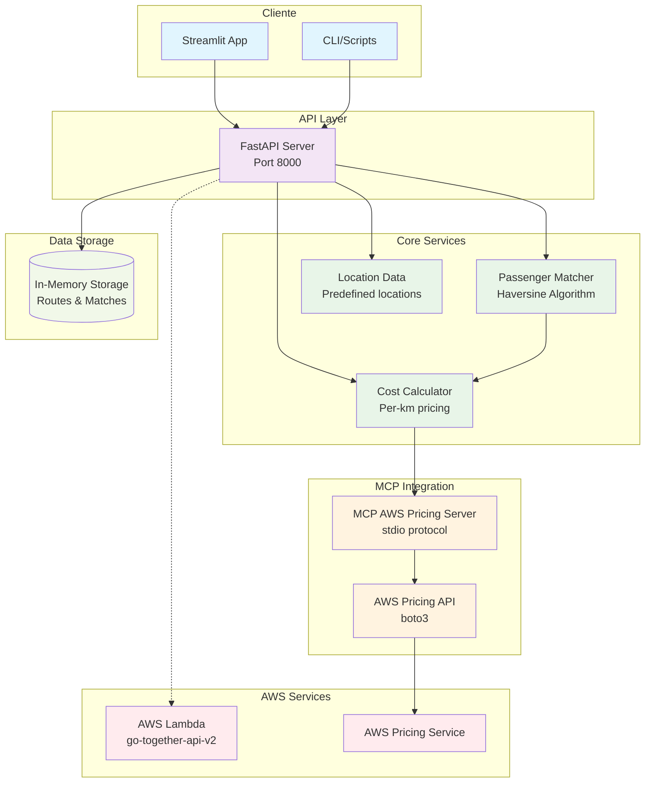

# Arquitetura do Sistema Go Together

## Diagrama de Arquitetura

## Componentes

### 1. **Interface do Usuário**
- **Streamlit App**: Interface web para cadastro e visualização
- **CLI/Scripts**: Testes e automação

### 2. **API Layer**
- **FastAPI Server**: API REST com endpoints para matching
- **Endpoints**: `/routes`, `/find-matches`, `/routes` (GET)

### 3. **Core Services**
- **Passenger Matcher**: Algoritmo Haversine para matching geográfico
- **Cost Calculator**: Cálculo de divisão de custos por passageiro
- **Location Data**: Localizações pré-definidas de São Paulo

### 4. **MCP Integration**
- **MCP Server**: Protocolo stdio para integração com Amazon Q
- **AWS Pricing API**: Estimativas de custo em tempo real

### 5. **AWS Services**
- **Lambda**: Deploy da API (go-together-api-v2)
- **Pricing Service**: Dados de preços AWS

### 6. **Storage**
- **In-Memory**: Armazenamento temporário de rotas e matches

## Fluxo de Dados

1. **Cadastro de Rota**: UI → API → Storage
2. **Busca de Match**: UI → API → Matcher → Cost Calculator → Response
3. **Estimativa AWS**: API → MCP → AWS Pricing → Response
4. **Deploy**: Local API → AWS Lambda (via CDK)